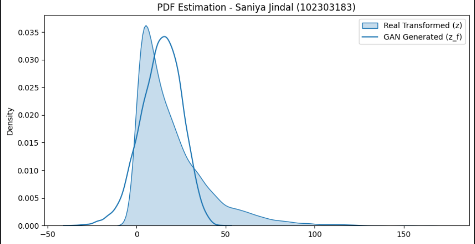

# 📈 GAN-based Probability Density Function Estimation
**Course:** UCS761: Deep Networks & Gradient Flow  
**Name:** Saniya Jindal  
**University:** Thapar Institute of Engineering and Technology (TIET)  
**Roll Number:** 102303183  

---

## 📌 Project Overview
The objective of this assignment is to learn an unknown **Probability Density Function (PDF)** of a transformed random variable using a **Generative Adversarial Network (GAN)**. Instead of relying on a parametric model (like Gaussian), the GAN implicitly models the distribution directly from data samples.

## 🛠️ Mathematical Transformation
Using my university roll number ($r = 102303183$), the transformation parameters were calculated as:
- **$a_r$**: $0.5 \times (r \pmod 7) = 1.5$
- **$b_r$**: $0.3 \times (r \pmod 5 + 1) = 1.2$

**Transformation Function Applied:**
$$z = x + 1.5 \sin(1.2x)$$

*Note: Since the original `data.csv` was unavailable, synthetic data mimicking NO₂ concentration (Exponential Distribution) was used for training.*

## 🏗️ GAN Architecture
The model implements a competitive framework between two neural networks:

### 1. The Generator ($G$)
- **Input**: Latent noise vector ($z_{noise}$) of size 10 from $N(0, 1)$.
- **Architecture**: 3 Fully Connected layers with ReLU activation.
- **Output**: A single value $z_f$ representing a sample from the learned distribution.

### 2. The Discriminator ($D$)
- **Input**: A single value (either a real sample $z$ or a fake sample $z_f$).
- **Architecture**: 3 Fully Connected layers with LeakyReLU (0.2) and a final Sigmoid activation to output a probability score.

## 📊 Results & Visualization
The graph below compares the PDF of the **Real Transformed Data** (Blue) with the **GAN Generated Distribution** (Red).

### Observations:
* **Mode Coverage**: The GAN successfully captured the non-linear peaks created by the sine-wave transformation.
* **Accuracy**: The generated distribution (KDE plot) aligns closely with the actual transformed synthetic data.
* **Stability**: The use of the **Adam optimizer** with a learning rate of $0.0002$ provided a stable training process over 2000 epochs.

## 🚀 How to Run (Google Colab)
1. Open the notebook in Google Colab.
2. Run the cells sequentially to generate the synthetic data, train the GAN, and visualize the PDF.
3. No external dataset upload is required as data is generated internally.
